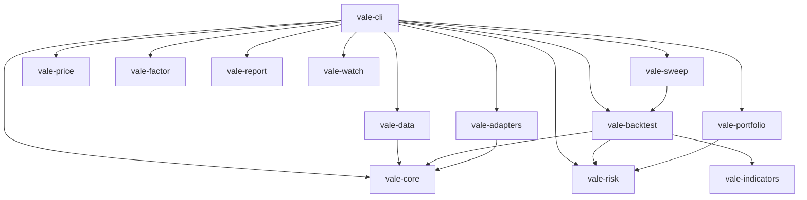

<p align="center">
  
</p>

<h1 align="center">Vale.sh</h1>

<p align="center">
  <strong>Quantitative finance at terminal speed.</strong>
</p>

<p align="center">
  <a href="https://github.com/Lucent-sh/vale.sh/actions"></a>
  <a href="https://github.com/Lucent-sh/vale.sh/releases"></a>
  
  
</p>

<p align="center">
  <a href="#install">Install</a> ·
  <a href="#quick-start">Quick start</a> ·
  <a href="#commands">Commands</a> ·
  <a href="#architecture">Architecture</a> ·
  <a href="ROADMAP.md">Roadmap</a> ·
  <a href="https://github.com/Lucent-sh">Lucent.sh</a>
</p>

---

**Vale** is a professional-grade quantitative finance CLI written in Rust. One binary (`vale`), a composable workspace of libraries, and a terminal experience built for speed: cold starts measured in milliseconds, native backtests on years of daily data, and output you can pipe to `jq` or drop into a spreadsheet.

Built by **[Lucent.sh](https://github.com/Lucent-sh)**.

## Why Vale

| | |
|---|---|
| **Correctness first** | Risk metrics, indicators, and pricing are native Rust with unit tests and known-value fixtures. |
| **Fast by default** | Sled-backed market data cache. Rayon-powered sweep engine (library). Event-driven backtest engine with no Python in the hot path. |
| **Terminal-native UX** | Amber-accented tables, ASCII equity curves, Ratatui dashboards for sweep and watch mode. Respects `NO_COLOR`. |
| **Composable** | Every command supports `--output table` (default), `json`, or `csv`. Same `BacktestResult` shape across engines. |
| **Honest scope** | Works without LEAN, VectorBT, or Python. Adapters are optional and reported by `vale doctor`. |

## Install

### Pre-built binary (recommended)

Download the latest release for your platform from [GitHub Releases](https://github.com/Lucent-sh/vale.sh/releases), or:

```bash
curl -fsSL https://raw.githubusercontent.com/Lucent-sh/vale.sh/main/scripts/install.sh | bash
```

Override install location:

```bash
VALE_INSTALL_DIR=~/.local/bin VALE_VERSION=v1.0.0 ./scripts/install.sh
```

### Build from source

```bash
git clone https://github.com/Lucent-sh/vale.sh.git
cd vale.sh
cargo build --release -p vale-cli
cp target/release/vale ~/.local/bin/
```

Requires **Rust 1.78+** (stable). See `rust-toolchain.toml`.

### First run

```bash
vale doctor          # verify toolchain, config, providers
vale config init     # ~/.vale/config.toml
```

## Quick start

```bash
# Market data (Yahoo, cached under ~/.vale/cache)
vale data fetch --ticker SPY --from 2020-01-01 --resolution daily

# Native backtest
vale backtest run \
  --engine native \
  --strategy buy_and_hold \
  --ticker SPY \
  --start 2020-01-01 \
  --end 2024-01-01

# Risk on an equity curve CSV (timestamp,equity)
vale risk metrics --input tests/fixtures/equity.csv

# European option (Black–Scholes)
vale price option \
  --type european-call \
  --spot 100 --strike 100 \
  --expiry 90d --vol 0.20 --rate 0.05

# Parameter sweep with checkpoint resume + live TUI
vale sweep run --ticker SPY --start 2020-01-01 --end 2024-01-01 \
  --strategy sma_crossover --checkpoint ~/.vale/sweep.ckpt

# Export bars to Parquet (Polars)
vale data export --ticker SPY --from 2020-01-01 --format parquet --out spy.parquet

# Shell completions (bash/zsh/fish)
vale completions bash > ~/.local/share/bash-completion/completions/vale

# JSON everywhere
vale --output json doctor | jq .
```

## Commands

| Command | Description |
|---------|-------------|
| `vale doctor` | Integration and config health check |
| `vale config` | `init`, `show`, `get`, `set`, `edit` |
| `vale data` | `fetch`, `inspect`, `export` (CSV/Parquet), `sources` (Yahoo, Polygon, Alpaca, local) |
| `vale backtest` | `run`, `compare`, `validate` (native, lean, vectorbt) |
| `vale sweep` | Grid search, Rayon parallel, `--checkpoint` resume, live TUI |
| `vale portfolio` | `optimize`, `backtest`, `efficient-frontier`, Black–Litterman |
| `vale risk` | `metrics`, `stress`, `correlation` |
| `vale price` | `option`, `bond`, `greeks` |
| `vale factor` | `analyze`, `ic` (FF3/FF5/Carhart4 via `--model`) |
| `vale report` | `tearsheet` (`--open`), `trades`, `show` |
| `vale strategy` | `scaffold`, `validate`, `list` |
| `vale watch` | Read-only monitor (Alpaca when keyed; explicit demo mode) |
| `vale completions` | bash, zsh, fish, elvish, powershell |

Global flags: `-o table|json|csv`, `--no-color`, `-v`. Running `vale` with no subcommand prints help (exit 0).

Built-in native strategies: `buy_and_hold`, `sma_crossover`.

## Architecture



**Crate layout**

```
crates/
  vale-cli/          # Binary, theme, Ratatui dashboards
  vale-core/         # Types, config, cache, errors
  vale-data/         # Yahoo, Polygon, Alpaca, Polars export, cache
  vale-backtest/     # Event-driven engine + strategies
  vale-sweep/        # Grid + Rayon runner
  vale-risk/         # Metrics, drawdown, stress
  vale-indicators/   # SMA, EMA, RSI, MACD, ATR, …
  vale-portfolio/    # Optimization + frontier
  vale-price/        # Black–Scholes, bonds
  vale-factor/       # Fama–French, OLS, IC
  vale-report/       # Tables, charts, HTML
  vale-watch/        # Broker + watch TUI
  vale-adapters/     # LEAN, VectorBT, OpenBB, QuantLib, optional PyO3
```

## Configuration

Global: `~/.vale/config.toml`  
Project overrides: `./vale.toml`

```toml
[core]
default_engine = "native"
cache_dir = "~/.vale/cache"

[providers]
default = "yahoo"

[providers.polygon]
api_key = ""   # vale config set providers.polygon.api_key <KEY>
```

## Development

```bash
cargo fmt --all
cargo clippy --workspace -- -D warnings
cargo test --workspace
cargo build --release -p vale-cli
```

See **[ROADMAP.md](./ROADMAP.md)** for release history and the v1.0.0 completion checklist.

## Versioning

Current release line: **v1.0.0**. Semver tags `v*` (or a `Cargo.toml` version bump on `main`) trigger [release builds](.github/workflows/release.yml).

## License

MIT © [Lucent.sh](https://github.com/Lucent-sh). See [LICENSE](./LICENSE).

---

<p align="center">
  <sub>vale.sh — built with Rust, Ratatui, and an unreasonable love of monospace.</sub>
</p>
